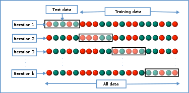

# Evaluation  

## Training vs Testing  

We should first address the concepts of training and testing. Instead of using the entire data, it is common to split the dataset into a training set and a testing set. Typically people use percentages such as 70% vs 30% or 80% vs 20%. The idea is to use only, say, 80% of the data for training, which means to run the select model on this part of data. Then you have a model with some coefficients (you can think of them as slopes) and test such results on the testing set to see how well the model performs. Since the part of the data for testing is not used in training, there is no double dipping. Sometimes people split the dataset into three sets: training, testing, and validation. So the trained models are used on the testing set for model selection. Then the validation set is used only once at the end to gauge how the model should perform if there's new data.  

## Metrics  

### Numerical Responses  

The most common metrics for numerical responses include mean squared errors (MSE), bias, and $R^2$ (or adjusted $R^2$).  The way to calculate MSE is: 
$$MSE = \frac{1}{n} \sum_{i=1}^n \bigg( \hat{y}_i - y_i \bigg)^2,$$
where $\hat{y}_i$ is the predicted outcome of the $i^{th}$ observation and $y_i$ is the $i^{th}$ observed outcome. The metric shows, on average, the squared distance between predictions and true responses. Bias is calculated as 
$$Bias = \frac{1}{n} \sum_{i=1}^n \bigg( \hat{y}_i - y \bigg).$$ 
The two metrics seem similar, but they reveal different aspects of model performance. In general, bias shows if the predictions are centered around the truth, while the MSE shows whether the predictions are centered around the truth *and* how far the predictions are from the truth. If the bias is zero, it means that the mean prediction goes towards the truth as the sample size increases to infinity. This is naturally a desired property, but you might be surprised that sometimes we are willing to accept some bias to reduce the variance.  

One important formula is 
$$MSE = Bias^2 + Variance,$$
where 
$$Variance = \frac{1}{n} \sum_{i=1}^n \bigg( \hat{y}_i - E(\hat{y}) \bigg)^2$$
and 
$$E(\hat{y}) = \frac{1}{n} \sum_{i=1}^n \hat{y}_i.$$
We skip the derivation here, but the interested readers can find the derivation readily online. The formula tells us that, if the MSE is large but the bias is small, this means the model has a large variance. This is to say, if you fit the model multiple times, it has quite different results. These formulas might seem too technical, but the message is important. There is a trade-off between bias and variance; in other words, there is no free lunch. A balance between bias and variance is where many methods strive to achieve.  

### Categorical Responses  

When the responses are categorical, a common way to measure the performance is a confusion matrix, which shows the numbers of predictions that are correct or incorrect. See some examples in [Workflow Demonstration]. Other metrics include sensitivity, specificity, precision, recall, and other metrics that try to combine these metrics to present a one-number summary.  

## Overfitting   

Overfitting means that the model can make good predictions with the available data, but it cannot generalize well on new data. It is like if a student memorizes all the past exam questions without really studying the materials, then, on the exam, the student can do really well on questions coming from past exams but might do poorly on questions never seen before. Splitting data into training and testing is one strategy to avoid overfitting. Certain ML methods are less likely to overfit, such as neural networks. And there are some more strategies, such as early stopping, that can be used. Our point here is to be aware of this potential pitfall of machine learning methods.  

## Cross Validation  

One very standard way of evaluation is $k$-fold cross validation, commonly with $k=5$ or $k=10$. The idea is simple. Divide the data into $k$ groups. Each time, choose $k-1$ groups for training, fit the model on the last group, which is the test data, and calculate the desired metrics, such as MSE. 

This way, although less data is used for training, the metrics should be more accurate, because now we are not using the same data points for training and testing. Using metrics from cross validation for model selection can ensure that your model does not overfit.  


```{r, include = FALSE}
show_fig <- function(f)
  {if (knitr::is_latex_output())
  {
    output = xfun::with_ext(f, 'pdf')
    rsvg::rsvg_pdf(xfun::with_ext(f,'svg'), file=output)
  } else {
    output = xfun::with_ext(f, 'svg')
  }
  knitr::include_graphics(output)
}
```


```{r, fig.cap="Image Source: https://en.wikipedia.org/wiki/Cross-validation_(statistics)", echo = FALSE}
show_fig("images/K-fold_cross_validation_EN.svg")
```


```{r, include = FALSE}
# You can also use math in footnotes like this^[where we mention $p = \frac{a}{b}$].

# We will approximate standard error to 0.027[^longnote]

# [^longnote]: $p$ is unknown but expected to be around 1/3. Standard error will be approximated

    # $$
    # SE = \sqrt(\frac{p(1-p)}{n}) \approx \sqrt{\frac{1/3 (1 - 1/3)} {300}} = 0.027
    # $$

```

```{r, include = FALSE}
# 
```

