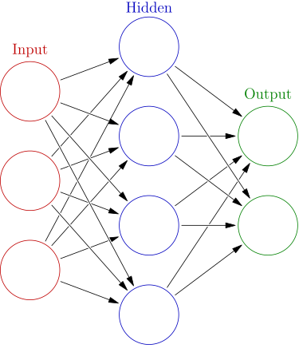

# Machine Learning Methods  

Here we discuss some machine learning methods you might find useful. Although linear regression models are commonly used, we skip it because it is well understood and many online resources can be easily located.   

## Tree-based Methods  

Tree-based methods are popular for their ease for interpretation. Essentially, the algorithm tries to split the data into subsets by finding the most significant (or consequential) variables in a way that reduces the prediction error the most. For example, in the graph below, the variable that helps reduce prediction error at the first level is gender. In other words, the property of being male or female can greatly help the algorithm predict the survival of passengers on Titanic. 

Decision trees are easy to use but not very accurate for complex data; however, we can go beyond one tree. If we use multiple trees and, for instance, take the average of the predictions of all the trees, we can improve the performance. This is the idea of ensemble methods. One of the ensemble methods, Random Forests, is commonly used, including in natural resources management, and quite accurate for many kinds of data. So next we'll dive into this one method.  

### Random Forests  

For Random Forests, the algorithm randomly selects a smaller number, say $m$, of predictors from the total number, say $p$, each time a tree is being fit. This process is repeated many times, for example, $500$ times. The average (for continuous responses) or the majority votes (for discrete responses) of the predictions from the individual trees are used as final predictions. By randomly choosing a subset of predictors each time, Random Forests can avoid relying on the same variables every time and prevent overfitting.  

Even though coefficients of each predictors are not available for random forests, you can easily get the important variables and at least know which variables are more important for predicting the response. You can also use Random Forests as a tool for variable selection and then use a different method to fit the model on a subset of predictors chosen by Random Forests.   

See [Workflow Demonstration] for examples of Random Forests models. 

### Other Ensemble Tree Methods  

Other ensemble tree methods include boosting and bagging. If you are interested, take a look at Chapter 8 (Tree-Based Methods) of *An Introduction to Statistical Learning* by @james2013introduction.  

## Neural Network  

Neural network has been enjoying its popularity. A neural network model is composed of an input layer, some hidden layers, and an output layer, as seen below. There is only one hidden layer below. When there are enough hidden layers, the model is then called deep learning. 

So the input layer is the observed predictors, and each of the hidden layers has nodes that contain coefficients. You can think of these coefficients similar to those for linear models, except they do not have linear relationships with the observed predictors. These values are derived as the best fit between data and some kind of cost function; essentially, these values are meant to minimize the differences between observed outcome and predictions. When the values from one hidden layer are passed onto the next layer, a nonlinear activation function called [ReLU](https://en.wikipedia.org/wiki/Rectifier_(neural_networks)) is commonly used. If the task is classification, the layer right before output is often an algorithm to turn the values into predicted class. While neural network is a powerful ML model, the values in the nodes in the hidden layers are not interpretable. So this indeed is a black-box method. For interested readers, check out Chapter 10 Deep Learning in @james2013introduction (*An Introduction to Statistical Learning*).  

## Gaussian Process (GP)  

Another ML method that could be useful for natural resource management type of research is Gaussian Process. This method, commonly called kriging in spatial statistics, is non-parametric, which sounds like there are no parameters in the model but in fact means there can be an infinite number of parameters. (Of course in any real model we'll have finite parameters, but that's the idea.) The fact that the parameters can increase towards infinity tells us that this is a flexible model. Essentially, for a GP model, and here I quote from Chapter 5 of Gramacy's *Surrogates*, "any finite collection of realizations (i.e. $n$ observations) is modeled as having a multivariate normal (MVN) distribution." In other words, the model tries to learn information from similar items, judging from some kind of distance from each other. MVN has some great properties. And, when there is a new data point, all the observed data points can be used to make prediction for it. 

GP is widely used in the machine learning, computer experiments, and spatial statistics communities. There are ready-made R packages, such as `GpGp` and `deepgp`. It's also easy to use in Python. Chapter 5 (["Gaussian Process Regression"](https://bookdown.org/rbg/surrogates/chap5.html)) of the book *Surrogates* by @gramacy2020surrogates is a great resource if you are interested in learning more about Gaussian process! If you would like to see some theory of GP, check out another classic book [*Gaussian Processes for Machine learning*](https://gaussianprocess.org/gpml/) by @CR2006gp.    
